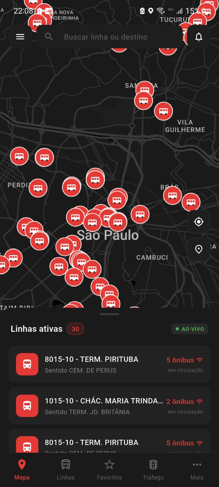
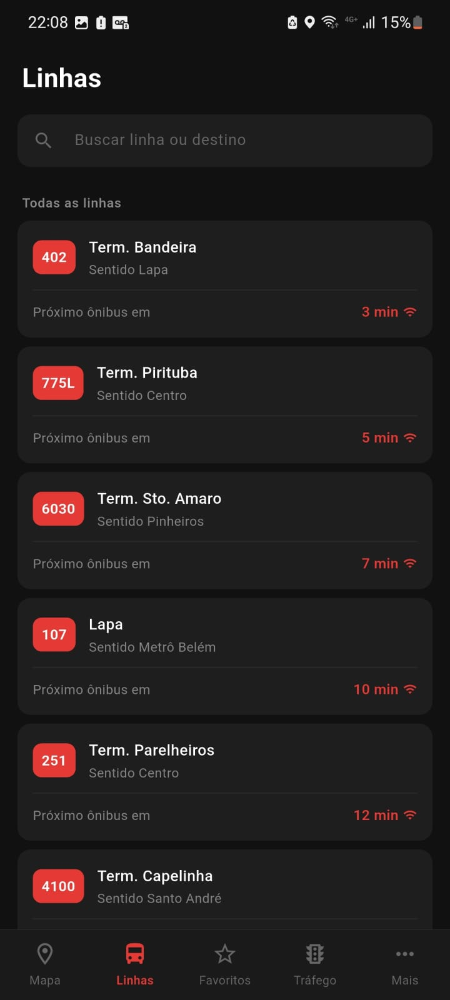
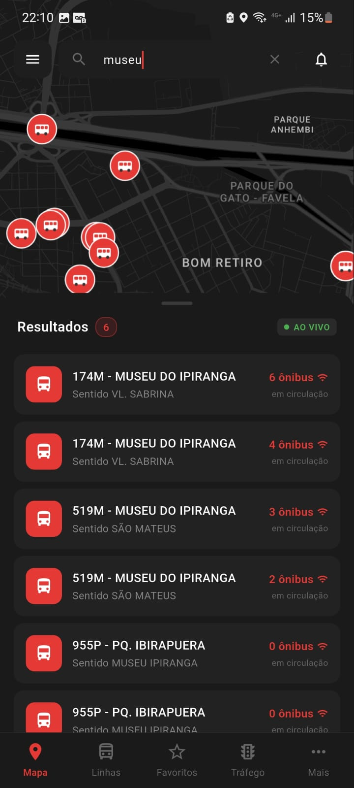
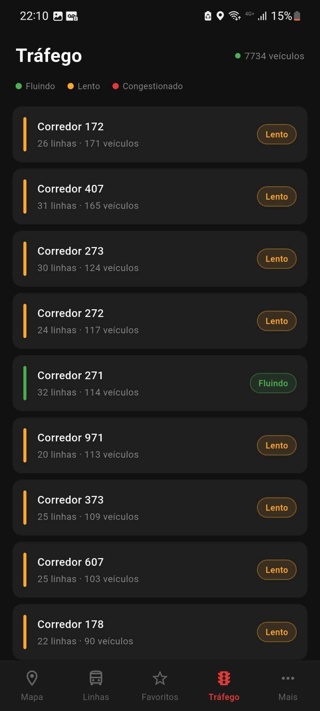
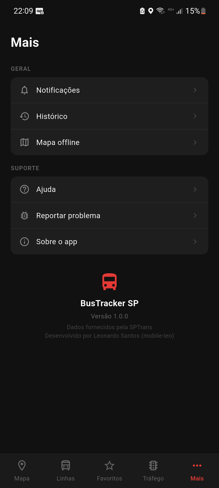

# BusTracker

[](https://flutter.dev)
[](https://dart.dev)
[](LICENSE)
[](https://github.com/mobile-leo)

Aplicativo móvel de rastreamento de ônibus em tempo real para a cidade de São Paulo, integrado à API oficial do Olho Vivo da SPTrans. Desenvolvido com Flutter seguindo Clean Architecture, com foco em performance, escalabilidade e experiência do usuário.

---

## Screenshots

<div align="center">
  
  
  
  <br/><br/>
  
  
  
</div>

---

## Funcionalidades

- **Mapa ao vivo** com posição de todos os veículos da frota da SPTrans em tempo real
- **Viewport-based rendering** — apenas os veículos visíveis na tela são renderizados, mantendo a UI fluida com +7.000 ônibus em circulação
- **Filtro por linha** — ao selecionar uma linha, o mapa destaca seus veículos e traça a rota completa com polyline
- **Paradas no mapa** com ícones distintos e detecção por zoom (aparecem automaticamente a partir do zoom 14)
- **Previsão de chegada em tempo real** por parada — bottom sheet com todas as linhas chegando e ETA em minutos
- **Alerta de chegada** — notificação nativa (push local) quando um ônibus estiver a N minutos da parada selecionada
- **Paradas favoritas** — salva paradas com acompanhamento rápido de previsão direto na aba de favoritos
- **Linhas favoritas** com acesso rápido a detalhes, itinerário e informações ao vivo
- **Histórico de linhas** consultadas, persistido localmente com limpeza sob demanda
- **Página de tráfego** com status dos corredores e vias monitoradas pelo SPTrans
- **Busca de linhas** integrada ao mapa com expansão automática do painel de resultados
- **Dark theme** com tema customizado e mapa noturno estilizado

---

## Arquitetura

O projeto segue **Clean Architecture** com separação estrita em três camadas:

```
lib/
├── core/                          # Configurações globais
│   ├── app_colors.dart            # Design tokens de cor
│   ├── app_theme.dart             # ThemeData global
│   ├── notification_service.dart  # Singleton de notificações locais
│   └── service_locator.dart       # DI manual (instanciação e wiring)
│
├── data/                          # Camada de dados
│   ├── datasources/
│   │   ├── sptrans_remote_datasource.dart   # Cliente HTTP + auth SPTrans
│   │   └── favorites_local_datasource.dart  # Persistência SharedPreferences
│   ├── models/                    # DTOs com fromJson/toJson
│   │   ├── bus_line_model.dart
│   │   ├── bus_position_model.dart
│   │   ├── bus_stop_model.dart
│   │   └── arrival_forecast_model.dart
│   └── repositories/              # Implementações concretas dos contratos
│       ├── sptrans_repository_impl.dart
│       └── favorites_repository_impl.dart
│
├── domain/                        # Camada de negócio (zero dependências externas)
│   ├── entities/                  # Modelos puros de domínio
│   │   ├── bus_line.dart
│   │   ├── bus_position.dart
│   │   ├── bus_stop.dart
│   │   └── arrival_forecast.dart
│   ├── repositories/              # Contratos (interfaces abstratas)
│   │   ├── sptrans_repository.dart
│   │   └── favorites_repository.dart
│   └── usecases/                  # Um arquivo por caso de uso
│       ├── get_bus_positions_usecase.dart
│       ├── get_stops_usecase.dart
│       ├── get_arrival_forecast_usecase.dart
│       ├── get_stop_forecast_usecase.dart
│       ├── search_lines_usecase.dart
│       ├── search_stops_usecase.dart
│       ├── manage_favorites_usecase.dart
│       └── manage_history_usecase.dart
│
└── presentation/                  # Camada de UI
    ├── pages/
    │   ├── home/                  # Shell de navegação com BottomNavigationBar
    │   ├── map/                   # Mapa principal com Google Maps
    │   ├── lines/                 # Busca e listagem de linhas + histórico
    │   ├── favorites/             # Linhas e paradas favoritas
    │   ├── line_detail/           # Detalhes, itinerário, horários e info ao vivo
    │   ├── traffic/               # Painel de tráfego / velocidade nas vias
    │   └── more/                  # Configurações e informações do app
    ├── providers/                 # Estado gerenciado via ChangeNotifier
    │   ├── map_provider.dart
    │   ├── lines_provider.dart
    │   ├── favorites_provider.dart
    │   ├── stop_forecast_provider.dart
    │   ├── arrival_alert_provider.dart
    │   └── history_provider.dart
    └── widgets/                   # Componentes reutilizáveis
        ├── nearby_lines_sheet.dart
        ├── stop_forecast_sheet.dart
        ├── arrival_alert_sheet.dart
        ├── favorite_stop_card.dart
        ├── map_search_bar.dart
        └── map_action_buttons.dart
```

---

## Decisões Técnicas de Performance

### Viewport-based Rendering (Culling Espacial)
A API SPTrans retorna ~7.000 veículos por requisição. Em vez de renderizar todos ou ordenar por distância do usuário (O(n log n)), o app utiliza **culling por bounding box** (O(n)) — apenas veículos dentro dos bounds visíveis do mapa são convertidos em `Marker`. 

```dart
bool _isInBounds(double lat, double lon, LatLngBounds bounds) {
  if (lat < bounds.southwest.latitude || lat > bounds.northeast.latitude) {
    return false;
  }
  // Tratamento de bounds que cruzam o antimeridiano
  final west = bounds.southwest.longitude;
  final east = bounds.northeast.longitude;
  return west <= east ? lon >= west && lon <= east : lon >= west || lon <= east;
}
```

### Limite Dinâmico por Zoom
O número máximo de markers visíveis escala com o nível de zoom: quanto mais afastado, menor o limite, evitando travamentos em zoom de cidade inteira.

| Zoom | Limite de Markers |
|------|-------------------|
| 16+  | 150               |
| 14   | 120               |
| 12   | 80                |
| 10   | 50                |
| < 10 | 30                |

### Debounce de Camera Move
O evento `onCameraMove` é disparado centenas de vezes por gesto. Um `Timer` de 150ms garante que o recálculo dos markers só ocorre após o gesto terminar.

### Polling Inteligente
Requisições à API a cada 30 segundos (intervalo real de atualização da SPTrans), com re-renderização somente dos markers no viewport atual — sem rebuild de toda a cena.

---

## Tecnologias

| Categoria | Tecnologia |
|-----------|-----------|
| Framework | Flutter 3.x / Dart 3.x |
| Mapas | Google Maps Flutter |
| HTTP | Dio + Cookie Manager (session auth SPTrans) |
| Estado | Provider (ChangeNotifier) |
| Persistência | SharedPreferences |
| Geolocalização | Geolocator + Permission Handler |
| Notificações | Flutter Local Notifications |
| Variáveis de ambiente | Flutter DotEnv |
| UI | Material Design 3 + tema dark customizado |

---

## Integrações com a API SPTrans (Olho Vivo)

| Endpoint | Uso |
|----------|-----|
| `POST /Login` | Autenticação por token (sessão via cookie) |
| `GET /Posicao` | Posição de todos os veículos da frota |
| `GET /Posicao/Linha` | Posição dos veículos de uma linha específica |
| `GET /Linha/Buscar` | Busca de linhas por termo ou número |
| `GET /Parada/BuscarParadasPorLinha` | Paradas de uma linha (itinerário) |
| `GET /Parada/Buscar` | Busca de paradas por nome ou endereço |
| `GET /Previsao/Parada` | Previsão de chegada de todos os ônibus numa parada |
| `GET /Previsao` | Previsão de chegada de uma linha numa parada |
| `GET /Velocidade` | Velocidade nas vias e corredores monitorados |

---

## Como Executar

**Pré-requisitos:** Flutter SDK 3.x, Android Studio ou Xcode, token da API SPTrans

1. Clone o repositório
```bash
git clone https://github.com/mobile-leo/BusTracker-Flutter.git
cd BusTracker-Flutter
```

2. Crie o arquivo `.env` na raiz do projeto
```env
SPTRANS_TOKEN=seu_token_aqui
GOOGLE_MAPS_API_KEY=sua_chave_aqui
```

3. Instale as dependências
```bash
flutter pub get
```

4. Execute o app
```bash
flutter run
```

> Para obter um token da API SPTrans, cadastre-se gratuitamente em [sptrans.com.br/desenvolvedores](https://www.sptrans.com.br/desenvolvedores).

---

## Padrões de Código

- **Clean Architecture** com separação estrita entre domain, data e presentation
- **Dependency Injection** manual via `ServiceLocator` — sem geração de código ou magic
- **Single Responsibility** — um arquivo por use case, um provider por domínio funcional
- **Sem ORM** — queries diretas à API REST com parsing manual de JSON
- **Sem comentários de código** — nomes de classes, métodos e variáveis são autoexplicativos
- **Imutabilidade** nas entidades de domínio

---

## Licença

MIT License — veja o arquivo [LICENSE](LICENSE) para detalhes.
